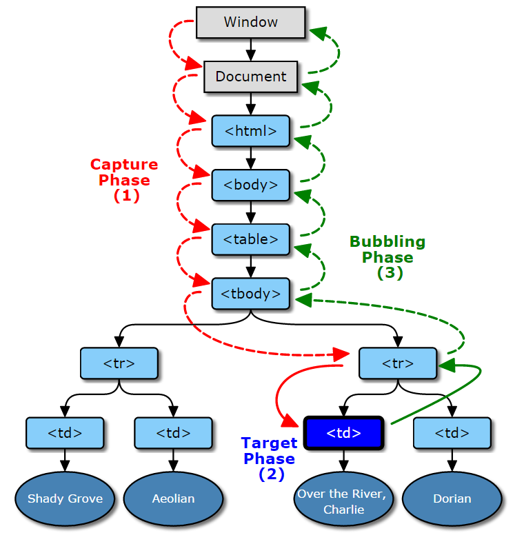

###javascript和事件 2015/08/03

>[原文](http://yujiangshui.com/javascript-event/)感谢提供答案。

###javascript和事件
>与浏览器进行交互的时候，浏览器就会触发各种事件。比如当我们打开某一个网页的时候，浏览器加载完成了这个网页，就会触发一个load事件；当我们点击页面中的某一个“地方”,浏览器就会在那个地方触发一个click事件。

>这样，我们就可以编写javascript，通过监听某一个事件，来实现某些功能扩展。例如监听load事件，显示欢迎信息，那么当浏览器加载完一个网页之后，就会显示欢迎信息。

>下面就来介绍一下事件。

###基础事件操作

####监听事件

1.HTML内联属性（避免使用）
>HTML元素里面直接填写事件有关属性，属性值为javascript代码，即可在触发该事件的时候，执行属性值的内容。

>例如：
```
	<button onclick="alert('你点击了这个按钮')">点击这个按钮</button>
```
>onclick属性表示触发click，属性值的内容（javascript代码）会在单击该HTML节点时执行。

>显而易见，使用这种方法，javascript代码必须与HTML代码耦合在一起，不便于维护和开发。所以除非在必须使用的情况(例如统计链接点击数据)下，尽量避免使用这种方法。

2.Dom属性绑定
>也可以直接设置Dom属性来指定某个事件对应的处理函数，这个方法比肩简单：
```
	element.onclick=function(event){
		alert("你点击了这个函数");
	}
```
上面代码就是监听element节点的click事件。它比较简单易懂，而且有较好的兼容性。但是也有缺陷，因为直接赋值给对应属性，如果你在后面的代码中再次element绑定一个回调函数，会覆盖之前的回调函数的内容。 

>虽然也可以用一些方法实现多个绑定，但是还是推荐下面的标准事件监听函数。

3.使用事件监听函数
>标准的事件监听函数如下：
```
element.addEventListener(<event-name>,<callback>,<use-captuer>)
```
表示在element这个对象上面添加一个事件监听器，当监听到有<event-name>事件发生的时候，调用<callback>这个回调函数。至于<use-capture>这个参数，表示该事件监听是在“捕获”阶段中监听（设置为ture）还是在冒泡阶段中监听（设置为false）。关于捕获和冒泡，我们会在下面讲解。

>用标准事件监听函数改写上面的例子：
```
var btn=document.getElementsByTayName('button');
btn[0].addEventListener('click',function(){
	alert('你点击了这个按钮');
},false);
```
这里最好是为HTML结构定义个ID或者Class属性，方便选择，在这里只作为显示使用。

4.移除事件监听
>当我们为某个元素绑定了一个事件，每次触发这个事件的时候，都会执行事件绑定的回调函数。如果我们想解除绑定，需要使用removeEventListenet方法
```
element.removeEventListenet(<event-name>,<callback>,<use-capture>);
```
需要注意的是，绑定事件时的回调函数不能是匿名函数，必须是一个声明的函数，因为解除事件绑定时需要传递这个回调函数的引用，才可以断开绑定。例如：
```
var fun=function(){
	//function logic
}
element.addEventListener('click',fun,false);
element.removeEventListener('click',fun,false);
```

####事件触发过程
>在上面大体了解了事件是什么、如何监听并执行某些操作，但我们对事件触发整个过程还不够了解。

>下面就是事件的触发过程，借用了w3c的图片

>

1.捕获阶段（Capture Phase）
>当我们在dom树的某个节点发生了一些操作（例如单击、鼠标移动上去），就会有一个事件发射过去。这个事件从window发出，不断经过下级节点直到目标节点。在到达目标节点之前的过程，就是捕获阶段（Captrue Phase）

>所有经过的节点，都会触发这个事件。捕获阶段的任务就是建立这个事件传递路线，以便后面冒泡阶段顺着这条路返回window。

>监听某个在捕获阶段触发的事件，需要再事件监听函数传递第三个参数true。
```
element.addEventListener(<event-name>,<callback>,true);
```
但一般使用时，我们往往传递false，会在后面说明原因。

2.目标阶段（Target Phase）
>当事件跑啊跑，跑到了事件触发目标节点那里，最终在目标节点上面触发这个事件，就是目标阶段。

>需要注意的是，事件触发的目标节总是最底层的节点。比如你点击一段文字，你以为你的事件目标节点在div上，但实际上触发在<p>、<span>等子节点上。例如：
```
document.addEventListener("click",function(e){
	alert(e.target.tagName);
},false);
```
>在demo中，我监听单击事件，将目标节点的tagname弹出来。当你点击加粗字体时，事件的目标节点就为最底层<string>节点。