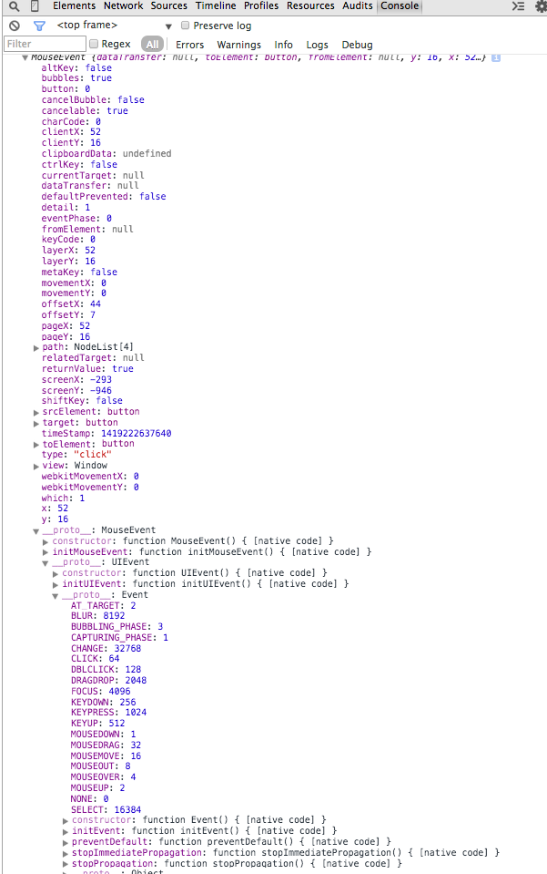

###javascript和事件 2015/08/03

>[原文](http://yujiangshui.com/javascript-event/)感谢提供答案。

###javascript和事件
>与浏览器进行交互的时候，浏览器就会触发各种事件。比如当我们打开某一个网页的时候，浏览器加载完成了这个网页，就会触发一个load事件；当我们点击页面中的某一个“地方”,浏览器就会在那个地方触发一个click事件。

>这样，我们就可以编写javascript，通过监听某一个事件，来实现某些功能扩展。例如监听load事件，显示欢迎信息，那么当浏览器加载完一个网页之后，就会显示欢迎信息。

>下面就来介绍一下事件。

###基础事件操作

####监听事件

1.HTML内联属性（避免使用）
>HTML元素里面直接填写事件有关属性，属性值为javascript代码，即可在触发该事件的时候，执行属性值的内容。

>例如：
```
	<button onclick="alert('你点击了这个按钮')">点击这个按钮</button>
```
>onclick属性表示触发click，属性值的内容（javascript代码）会在单击该HTML节点时执行。

>显而易见，使用这种方法，javascript代码必须与HTML代码耦合在一起，不便于维护和开发。所以除非在必须使用的情况(例如统计链接点击数据)下，尽量避免使用这种方法。

2.Dom属性绑定
>也可以直接设置Dom属性来指定某个事件对应的处理函数，这个方法比肩简单：
```
	element.onclick=function(event){
		alert("你点击了这个函数");
	}
```
上面代码就是监听element节点的click事件。它比较简单易懂，而且有较好的兼容性。但是也有缺陷，因为直接赋值给对应属性，如果你在后面的代码中再次element绑定一个回调函数，会覆盖之前的回调函数的内容。 

>虽然也可以用一些方法实现多个绑定，但是还是推荐下面的标准事件监听函数。

3.使用事件监听函数
>标准的事件监听函数如下：
```
element.addEventListener(<event-name>,<callback>,<use-captuer>)
```
表示在element这个对象上面添加一个事件监听器，当监听到有<event-name>事件发生的时候，调用<callback>这个回调函数。至于<use-capture>这个参数，表示该事件监听是在“捕获”阶段中监听（设置为ture）还是在冒泡阶段中监听（设置为false）。关于捕获和冒泡，我们会在下面讲解。

>用标准事件监听函数改写上面的例子：
```
var btn=document.getElementsByTayName('button');
btn[0].addEventListener('click',function(){
	alert('你点击了这个按钮');
},false);
```
这里最好是为HTML结构定义个ID或者Class属性，方便选择，在这里只作为显示使用。

4.移除事件监听
>当我们为某个元素绑定了一个事件，每次触发这个事件的时候，都会执行事件绑定的回调函数。如果我们想解除绑定，需要使用removeEventListenet方法
```
element.removeEventListenet(<event-name>,<callback>,<use-capture>);
```
需要注意的是，绑定事件时的回调函数不能是匿名函数，必须是一个声明的函数，因为解除事件绑定时需要传递这个回调函数的引用，才可以断开绑定。例如：
```
var fun=function(){
	//function logic
}
element.addEventListener('click',fun,false);
element.removeEventListener('click',fun,false);
```

####事件触发过程
>在上面大体了解了事件是什么、如何监听并执行某些操作，但我们对事件触发整个过程还不够了解。

>下面就是事件的触发过程，借用了w3c的图片

>

1.捕获阶段（Capture Phase）
>当我们在dom树的某个节点发生了一些操作（例如单击、鼠标移动上去），就会有一个事件发射过去。这个事件从window发出，不断经过下级节点直到目标节点。在到达目标节点之前的过程，就是捕获阶段（Captrue Phase）

>所有经过的节点，都会触发这个事件。捕获阶段的任务就是建立这个事件传递路线，以便后面冒泡阶段顺着这条路返回window。

>监听某个在捕获阶段触发的事件，需要再事件监听函数传递第三个参数true。
```
element.addEventListener(<event-name>,<callback>,true);
```
但一般使用时，我们往往传递false，会在后面说明原因。

2.目标阶段（Target Phase）
>当事件跑啊跑，跑到了事件触发目标节点那里，最终在目标节点上面触发这个事件，就是目标阶段。

>需要注意的是，事件触发的目标节总是最底层的节点。比如你点击一段文字，你以为你的事件目标节点在div上，但实际上触发在```<p>```、```<span>```等子节点上。例如：
```
document.addEventListener("click",function(e){
	alert(e.target.tagName);
},false);
```
>在demo中，我监听单击事件，将目标节点的tagname弹出来。当你点击加粗字体时，事件的目标节点就为最底层<string>节点。

3.冒泡阶段（Buddling Phase）
>当事件达到目标节点之后，就会沿着原来返回，由于这个过程类似水泡从底部浮到顶部，所有称作冒泡阶段。

>在实际使用过程中，你并不需要把事件监听函数准确绑定到最底层的节点也是可以正常工作。比如在上例，你想为这个```<div>```绑定单击时的回调函数，你无须为这个```<div>```下面的所有子节点全部绑定单击事件，只需要为```<div>```这一个节点绑定即可。因为发生它子节点的单击事件，都会冒泡上去，发生在```<div>```上面。

4.为什么不用第三个参数true
>介绍完上面三个事件触发阶段，我们来看下这个问题。

>所有介绍事件的文章都会说，在使用addEventListener函数来监听事件时，第三个参数设置为false，这样监听事件时只会监听事件冒泡阶段发生的事件。

>这是因为IE浏览器不支持在捕获阶段监听事件，为了统一而设置的，毕竟IE浏览器的份额是不可忽略的。

>IE浏览器在事件这方面与标准还有一些其他差异，我们会在后面集中介绍。

####使用事件代理（Event Delegate）提升性能。
>因为事件有冒泡机制，所有子节点的事件都会顺着父级节点跑回去，所以我们可以通过监听父级节点来实现监听子节点的功能，这就是事件代理。

>使用事件代理的主要两个优势：
>1.减少事件绑定，提示性能。之前你需要绑定一堆子节点，而现在绑定一个父节点即可。减少了绑定事件监听函数的数量。
>2.动态变化的DOM节点结构，仍然可以监听。当一个DOM动态创建之后，不会带有任何事件监听，除非你重新执行事件绑定函数，而使用事件监听无须担忧这个问题。
```
$(".ul1 a").on("click",function(){
	alert('正在监听');
});
$(".ul2").on("click","a",function(){
	alert('正在监听');
});
$(".add-more-items").on("click",function(){
	var item=$('<li><a href="#">我是动态新增节点</a></li>');
	$(".ul1,.ul2").append(item)
})
```

>上面例子中，为了简便，我使用jquery来实现普通事件绑定和事件代理。我的目标是监听所有a链接的单击事件，.ul1是常规的事件绑定方法，jquery会循环每一个.ul>a结构并绑定事件监听函数。.ul2则是事件监听的方法，jquery只为.ul2结构绑定事件监听函数，因为.ul2下面可能会有很多无关节点也会触发click事件，所以我在on函数里传递了第二个参数，表示只监听a子节点事件。

>它们都可以正常工作，但是当我动态创建新dom结构的时候，第一个ul问题就出现了，新创建结构虽然还是.ul1>a，但是没有绑定事件，所以无法执行回调。而第二个ul工作的很好，因为新创建的dom，它的事件会冒泡到父级节点进行处理。

>如果使用原生的方法实现事件代理，需要注意过滤非目标节点，可以通过id、class或者tagname等等，例如：
```
element.addEventListener("click",function(){
	//判断是否是a节点
	if(event.target.tagName=="a"){
		//a的一些交互
	}
},false);
```

####停止事件冒泡（stopPropagation）
>所有的事情都会有对立面，事件的冒泡阶段虽然看起来很好，也会有不适合的场所。比较复杂的应用，由于事件监听比较复杂，可能会希望只监听发生在具体节点的事件。这个时候就需要停止事件冒泡、

>停止事件冒泡需要使用事件对象的stopPropagation方法，具体代码如下：
```
element.addEventListener('click',function(){
	event.stopProopagation();
})
```
>在事件监听回调函数里，会传递一个参数，这就是Event对象，在这个对象上调用stopPropagation方法即可停止事件冒泡。
```
	html:
	<div class="overlay">Click outside to close.</div>
	css:
	*{
		-moz-box-sizing:border-box;
			 box-sizing:border-box;
	}
	html,
	body{
		height:100%;
		margin:0;
		font:bold 64px/70px helvetica;
		background:#41b7d8;
		color:red;
	}
	.overlay{
		position: absolute;
		top:0;
		right:0;
		bottom:0;
		left:0;
		height:80%;
		width:80px;
		margin:auto;
		padding:20px;
		background:#fff;
		box-shadow:1px 4pxx 40px rgba(0,0,0,0.5);
	}
	js:
	var overlay=document.querySelector('.overlay');
	overlay.addEventListener('click',function(event){
		event.stopPropagation()
	});
	document.addEvenListener('click',function(event){
		overlay.parentNode.removeChild(overlay);
	})
```
>在上面例子中，有一个弹出层，我们可以在弹出层上做任何操作，例如click等。当我们想关掉这个弹出层，在弹出层外面的任意结构中点击即可关掉。它首先对document节点进行click事件监听，所有的click事件，都会让弹出层隐藏掉。同样的，我们在弹出层上面的单击操作也会导致弹出层隐藏。之后我们对弹出层使用停止事件冒泡，掐断了单击事件返回document的冒泡路线，这样在弹出层的操作就不会被document的事件处理函数监听到。

>更多关于Event对象的事情，我们会在下面介绍。

####事件的Event对象
>当一个事情被触发的时候，会创建一个事件对象(Event Object),这个对象包含了一些有用的属性或者方法。事件对象会作为第一次参数，传递给我们的回调函数。我们可以使用下面的代码，在浏览器中打印出这个事件对象：
```
<button>打印Event Objcet</button>
<script>
	var btn=document.getElementsByTayName('button');
	btn[0].addEventListener("click",function(event){
			console.log(event);
		},false)
</script>
```

>就可以看到一堆属性列表

事件对象包含很多有用的信息，比如事件触发时，鼠标在屏幕上的坐标、被触发的dom详细信息、以及上图最下面继承过来的停止冒泡方法（stopPropagation）。下面介绍以下比较常用的几个属性和方法。
1.```type```(string)
事件的名称，比如“click”。
2.```target```(node)
事件要触发的目标节点。
3.```bubbles```(boolean)
表明该事件是否是在冒泡阶段触发的。
4.```preventDefault```(functhin)
这个方法可以禁止一些默认的因为，例如点击a标签时，会打开一个新页面，如果为a标签监听事件click同时调用该方法，则不会打开新页面。
5.```stopImmediatePropagation```(function)
与stopPropagation类似，就是阻止触发其他监听函数。但是与stopPropagation不同的是，它更加强力，阻止除了目标之外的事件触发，甚至阻止针对同一个目标节点的相同事件。
6.cancelable(boolean)
这个属性表明该事件是否可以用过调用event.preventDefault方法来禁用默认行为。
7.eventPhase(number)
这个属性的数字表明当前事件触发在什么阶段。none：0；捕获：1；目标：2；冒泡：3；。
8.pageX和pageY(number)
这两个属性表示触发事件时，鼠标相对于页面的坐标。
9.isTrusted(boolean)
表明该事件是浏览器触发(用户真实操作触发)，还是javascript代码触发的。

###jquery中的事件
>如果你在写文章或者demo，为了简单，你当然可以用上面的事件监听函数，以及那些对事件对象提供的方法等。但在实际中，有一些方法和属性是有兼容性问题的，所以我们会使用jquery来消除兼容性问题。

>下面简单来说一下jquery中事件的基础操作。

1.绑定事件和事件代理
>在jquery中，提供了诸如click()这样的语法糖来绑定对应事件，但是这里推荐统一使用on()来绑定事件。语法：
```
$().on(events,[selector],[data],handler)
```	
events即为事件的名称，你可以传递第二个参数来实现事件代理。

2.处理过兼容性的事件对象（Event Object）
>事件对象有些方法等也有兼容性差异，jquery将其封装处理，并提供跟标准一致的命名。

>如果你想在jquery事件回调函数中访问原来的事件对象，需要使用event.originalEvent，它指向原生的事件对象。

3.触发事件trigger方法
>点击某个绑定了click事件的节点，自然会触发该节点的click事件，从而执行对应回调函数。

>trigger方法可以模拟触发事件，我们单击另一个节点elementB，可以使用：
```
$(elementB).on("click",function(){
	$(elementA).trigger("click");
})
```
来触发elementA节点的单击监听回调函数。

###事件进阶话题
1.IE浏览器的差异和兼容性问题。
>IE浏览器就是特立独行，它对于事件的操作与标准有一些差异。不过IE浏览器现在也开始慢慢努力改造，让浏览器变得更加标准。

2.IE下绑定事件
>在IE下面绑定一个事件监听，在IE9-无法使用标准的addEventListener函数，而是使用自家的attachEvent，具体用法：
```
element.attachEvent(<event-name>,<callback>);
```
其中<event-name>参数需要注意，它需要为事件名称添加on前缀，比如有个事件叫click，标准事件监听函数监听click，IE这里需要监听onclick。

另一个，它没有第三个参数，也就是说它只支持监听在冒泡阶段触发的事件，所以为了统一，在使用标准事件监听函数的时候，第三个参数传递false。

当然，这个方法在IE9已经被抛弃，在IE11已经被移除，IE也在慢慢变好。

3.IE中Event对象需要注意的地方
>IE中往回调函数中传递的事件与标准也有一些差异，你需要使用window.event来获取事件对象。所以你通常会写出下面代码来获取事件对象：
```
	event=event || window.event
```	
此外还有一些事件属性有差别，比如比较常用的event.target属性，IE中没有，而是使用event.srcElement来代替。如果你的回调函数需要处理触发事件的节点，那么需要写
```
	node=event.srcElement || event.target
```
常见的就是这点，更细节的不再多说。在概念学习中，我们没有必要哦为不标准的东西支付学习成本；在实际应用中，类库已经帮我们封装好这些兼容性问题。可喜的是IE浏览器现在也开始不断向标准进步。

####事件回调函数的作用域问题
1.与事件绑定在一起的回调函数作用域会有问题，我们来看个例子：
>```
	html
	<button id="element">Click Me</button>
	js
	var element=document.getElementById('element');
	var user={
		firstname:'bob',
		greeting:function(){
			alert("My name is"+this.firstname);
		}
	};
	element.addEventListener('click',user.greeting)
```
回调函数调用的user.greeting函数作用域应该是在user下的，本期望输出my name is bob 结果却输出了 My name is undefined。这是因为事件绑定函数时，该函数会以当前元素为作用域执行。为了证明这一点，我们可以为当前element添加属性：
```
	element.firstname="jiangshui"
```
再次点击，可以正确弹出My name is jiangshui。那么我们来解决一下这个问题。

2.使用匿名函数
>我们为回调函数包裹一层匿名函数。
```
	html
	<button id="element"></button>
	js
	var element=document.getElementByid("element");
	var user={
		firstname:'Bod',
		greeting:function(){
			alert('My name is'+this.firstname);
		}
	};
	element.addEventListener("click",function(){
		user.greeting();
	})
```
包裹之后，虽然匿名函数的作用域被指向事件触发元素，但执行的内容就像直接调用一样，不会影响其作用域。

3.使用bind方法
>使用匿名函数室友缺陷的，每次调用都要包裹进匿名函数里面，增加了冗余代码等，此外如果想使用removeEventListener解除绑定，还需要再创建一个函数引用。Function类型提供了bind方法，可以为函数绑定作用域，无论函数在哪里调用，都不会改变它的作用域。通过如下语句绑定作用域：
```
	user.greeting=user.greeting.bind(user)
```
这样我们可以直接调用
```
	element.addEventLsitener("click",user.greeting)
```

####常用事件和技巧
>用户的操作有很多种，所以有很多事情。为了开发方便，浏览器有提供了一些事件，所以有很多很多的事件。这里只介绍一种常用的事件和使用技巧。

1.load
>load事件在资源等待加载完时触发。这个资源可以是图片、css文件、js文件、视频、document、window等等。

>比较常用的就是监听window的load事件，当页面内所有资源全部加载完成之后就会触发。比用js对图片以及其他资源处理，我们在load事件中触发，可以保证js不会在资源为加载完成就开始处理资源报错。

>同样的，也可以监听图片等其他资源加载情况。

2.beforeunload
>当浏览者在页面上的输入框输入一些内容时，未保存、误操作关掉网页可能导致输入信息丢失。

>当浏览者输入信息但未保存时关掉网页，我们就可以开始监听这个事件，例如：
```
window.addEventListener("beforeunload",function(event){
	event.returnValue="放弃当前未保存内容而关闭页面？";
})
```
这时候试图关闭网页的时候，会弹窗阻止操作，点击确认之后才会关闭。当然，如果没有这个必要，就不要监听，不要以为使用它可以为你留着浏览者。

3.resize
>当节点尺寸发生变化时，触发这个事件。通常用在window上，这样可以监听浏览器窗口的变化，通常用在复杂布局和响应式上。

>常见的视差滚动效果网站以及同类比较复杂的布局网站，往往使用javascript来计算尺寸、位置。如果用户调整浏览器大小、尺寸、位置不随着改变则会出现错位情况。在window上监听该事件，触发时调用计算尺寸、位置函数，可以根据浏览器的大小来重新计算。

>但需要注意一点，当浏览器发生任意变化都会触发resize事件，哪怕是缩小1px的浏览器宽度，这样调整浏览器时会触发大量的resize事件，你的回调函数就会被大量的执行，导致卡、崩溃等。

>你可以使用函数throttle和debounce技巧来进行优化，throttle方法的大体思路就是在某一段时间内无论多次调用，只执行一次函数，到达时间就执行；debounce方法大体思路就是在某一段时间内等待是否还会重复调用，如果不会再调用，就执行函数，如果还有重复调用，则不执行继续等待。

4.error
>当我们加载资源失败或者加载成功但是只加载一部分而无法使用时，就会触发error事件，我们可以通过监听该事件来提示一个友好的报错或者进行其他处理。比如js资源加载失败，则提示尝试刷新；图片资源加载失败，在图片下面提示图片加载失败等。该事件不会冒泡。因为子节点加载失败，并不意味着父节点加载失败，所以你的处理函数必须精确绑定到目标节点。

>需要注意的是，对于该事件，你可以使用addEventListener等进行监听，但是有时候会出现失效，这是因为error事件都触发过了，你的js监听处理代码还没加载进来执行。为了避免这种情况，用内联法更好一些。
```

```

####用javascript模拟触发内置事件
>内置的事件也可以被javascript模拟触发，比如下面函数模拟触发单击事件：
```
function simulateClick(){
	var event=new MouseEvent("click",function(){
			"view":window,
			"bubbles":true,
			"cancelable":true
		});
	var cb=document.getElementById("checkbox");
	var canceled=!cb.dispatchEvent(event);
	if(canceled){
		alert("canceled");
	}else{
		alert("not canceled");
	};
}
```